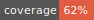

# React Csv Pooling Hook

Poolling a csv file data from react hook


## Activity

[](LICENSE)

[](https://github.com/javierlopezdeancos/react-csv-pooling-hook/issues)
[](https://github.com/javierlopezdeancos/react-csv-pooling-hook/releases)


## data

Data that returns the network call.

### Generic

Data could be defined with a generic when we define our hook to be used:

```jsx
 const { data, meta, signal, actions } = useNetworkState<string>();
```

## meta

### loading

The hook will return a loading state.

### error

The hook will return an error state.

### errorMessage

The hook will return an error message.

## Actions

### start

Turns the loading state to true.

### end

Turns the loading state to false.

### abort

Turns the loading state to false and abort the network call.

### resetError

Turns the error state to false and initialize error message to ''.

### setError

Turns the loading state to false, the error state to true and sets the error message.

### setData

Set data that should return the hook.

### setLoading

Set the loading state.

### resetSignal

Reset the abort controller to a new one.

This action is important when you want to abort the network call.

```jsx
actions.start();

try {
  const response = await fetch(url, { signal }) as any;
  const d = await response.json();

  actions.setData(d);
} catch (error: any) {
  if (error as DOMException) {
    actions.resetSignal();
    return;
  }

  actions.setError();
} finally {
  actions.end();
}
```

### setController

Set the abort controller.

## Use example

### useFetchFromMyApi.hook.ts

```ts
import { useNetworkState, UseNetworkStateReturn } from 'useNetworkSate';

type UseFetchFromMyApiReturn = {
  data: unknown;
  meta: {
    isLoading: boolean;
    isError: boolean;
    errorMessage: string;
  };
  fetchFromMyApiExampleByName: (name: string) => UseNetworkStateReturn;
};

export default function useFetchFromMyApi(): UseFetchFromMyApiReturn {
  const { data, meta, actions, signal } = useNetworkState();

  const fetchFromMyApiExample = async (name = 'defaultName') => {
    actions.startRequest();

    try {
      const response = await fetch(`https://my-api.com/?name=${name}`, signal);
    } catch (error) {
      actions.setErrorState(error);
    } finally {
      actions.endRequest();
    }
  };

  return { data, meta, fetchFromMyApiExampleByName };
}
```

### App.component.ts

```tsx
import { useEffect } from 'react';
import useFetchFromMyApi from './useFetchFromMyApi';

export default function App() {
  const { data, meta, fetchFromMyApiExampleByName } = useFetchFromMyApi();

  useEffect(() => {
    fetchFromMyApiExampleByName('Rick');
  }, []);

  if (meta.isLoading) {
    return <div>Loading...</div>;
  }

  return <div>data: {JSON.stringify(data, null)}</div>;
}
```
